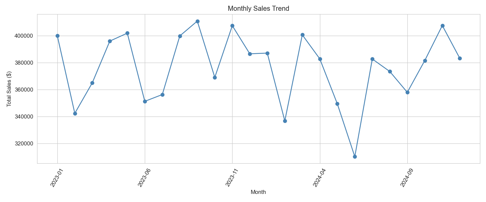
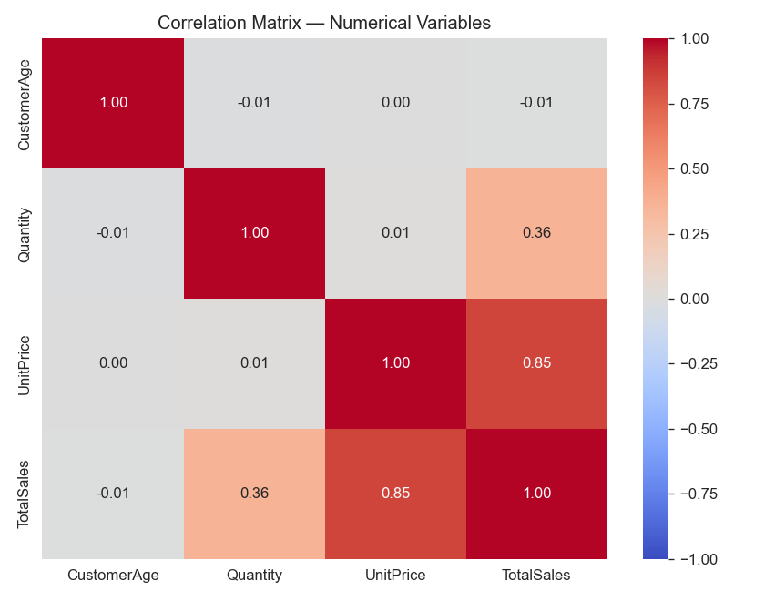

# EDA on Retail Sales Data

## Objective
Perform exploratory data analysis on a retail sales dataset to uncover sales trends,
customer demographics, and product performance insights.

## Tech Stack
Python, pandas, matplotlib, seaborn, Jupyter Notebook

## What this covers
- Data loading, inspection, and cleaning
- Descriptive statistics (mean, median, mode, std)
- Monthly and quarterly sales trend analysis
- Customer age group and gender demographics
- Top 10 best-selling products and revenue by category
- Correlation heatmap of numerical variables
- Day-of-week × hour sales heatmap (non-obvious insight)
- Business recommendations based on findings

## How to run
1. `pip install -r requirements.txt`
2. Open `EDA_Retail_Sales_Analysis.ipynb` in VS Code or Jupyter
3. Select a Python 3.10+ kernel
4. Run all cells

## Bonus
`eda_dashboard.html` is a standalone visual summary of the same analysis —
just open it directly in any browser.

## Sample outputs

